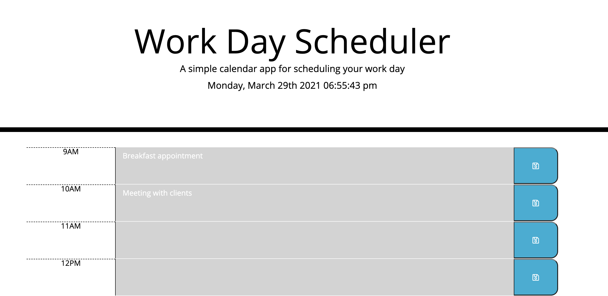
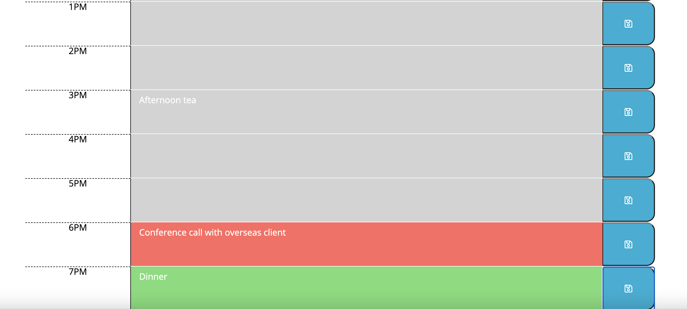
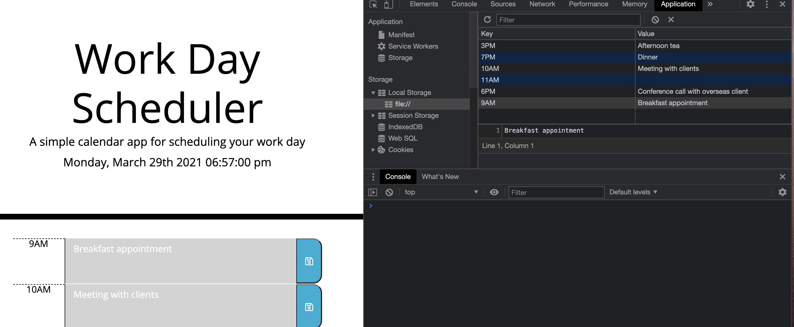

# 05 Third-Party APIs: Work Day Scheduler
Project Owner: Aaron Au Yoong
 
View live link here: https://aaronauyoong.github.io/workdayscheduler/.

## Introduction
As employees with busy schedules, there comes a need to keep track of important daily events for effective time management. This work day scheduler application allows users to achieve effective time management, through features such as current datetime display, viewing office hour timeblocks, adding events and more.  

This application will be created through the refactoring of provided code from Monash University's Bootcamp FSF program.

## Technologies
This app will run in the browser, and feature dynamically updated HTML and CSS powered by jQuery.

## Functionalities
Below are the functionalities of the app:

1. Current datetime is displayed at the top of the calendar
2. Scrolling down shows timeblocks for standard business hours
3. Each timeblock is colour-coded to indicate whether it is in the past, present or future. 
4. When clicking into a timeblock, users can enter an event and save it to localStorage.
5. Saved event persists after user refresh/reload of page. 

Application is made to resemble the homework mock-up, as shown below. 
 

* Note that I extended the day scheduler to begin at 9am, and end at 7pm. 

## Screenshots 

1. Screenshot of landing page,  displaying current time and past timeblocks (grey).
 

 
 

2. Screenshot of current timeblock (red), and future timeblocks (green).
 

 
 

3. Screenshot of console, showing that entered data is saved to localStorage.  Data remains after page refresh.
 

 
 

